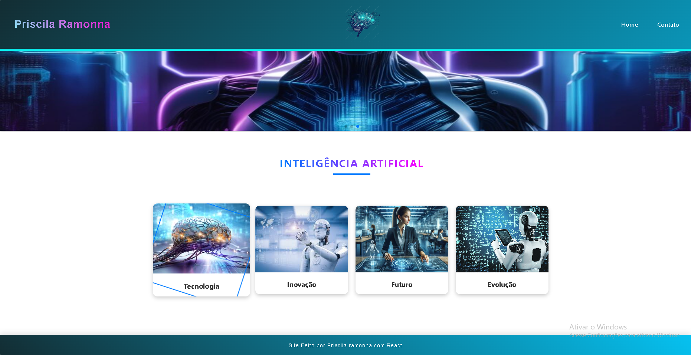

# 💡 Projeto Inteligência Artificial - Front-End

Este é um projeto de front-end desenvolvido com **HTML, CSS, JavaScript** e **React**, com o objetivo de criar uma interface moderna, interativa e responsiva para demonstração de funcionalidades com foco em usabilidade e visual atrativo.

---

## 🚀 Tecnologias Utilizadas

- 🧱 **HTML** – Estrutura da página
- 🎨 **CSS** – Estilização e layout responsivo
- ⚙️ **JavaScript** – Lógica e interações
- ⚛️ **React** – Biblioteca para construção da interface

---

## 🧭 Como Rodar o Projeto Localmente

1. Clone o repositório:

git clone https://github.com/Princyrr/iartificial.git

* Navegue até o diretório do projeto:

cd iartificial

Instale as dependências:

npm install

Inicie o servidor local:

npm start

Abra o navegador e acesse: http://localhost:3000

## 📸 Telas do Projeto

### 🖼️ Tela Inicial

### 🔻 Rodapé (Footer)

## 📬 Contato
Caso tenha interesse em saber mais ou colaborar, entre em contato:

📧 [Email](mailto:princyrpiress@email.com)
💼 [LinkedIn](https://www.linkedin.com/in/priscila-pires-171617128/)  
🐙 [GitHub](https://github.com/Princyrr)
